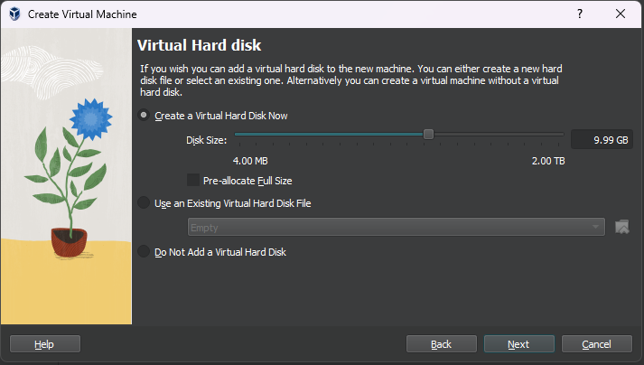

# Preparing for the Journey


Before you set off on your adventure to master Grafana Cloud, you need to ensure your gear is ready. In this step, you'll install VirtualBox and set up an Ubuntu virtual machine that you'll use in the remaining lab exercises.

> **🪄 Protip:**
> If you already have an Ubuntu Linux VM or cloud instance, you can use that instead of Virtualbox. Skip straight to [The First Trial](../02-the-first-trial/README.md) if you already have Ubuntu installed and ready.

## System Requirements

- **Virtualization Enabled**: Ensure virtualization is enabled in your laptop's BIOS/UEFI settings.
- **Operating System**: This tutorial covers setup on Windows, macOS, and Linux.
- **CPU**: A dual-core processor or better is recommended.
- **RAM**: At least 2GB of available RAM to allocate to the virtual machine.
- **Disk Space**: 10GB free disk space for your Ubuntu virtual machine.

## VirtualBox Installation

### 🪟 Windows:

1. **Download VirtualBox**:
   - Visit the [VirtualBox Downloads page](https://www.virtualbox.org/wiki/Downloads) and select the **Windows hosts** version.
   
2. **Install VirtualBox**:
   - Once the download is complete, run the installer.
   - Accept the license agreement and proceed through the installation steps. Stick with the default options unless you have specific needs.
   - When prompted by Windows, allow VirtualBox to install any necessary drivers.

3. **Verify Installation**:
   - After installation, open VirtualBox to verify it's working. You should see the main VirtualBox Manager screen.

### 🍎 MacOS:

1. **Download VirtualBox**:
   - Go to the [VirtualBox Downloads page](https://www.virtualbox.org/wiki/Downloads) and download the **macOS version**.

2. **Install VirtualBox**:
   - Open the `.dmg` file and drag VirtualBox into your Applications folder.
   - If you receive a warning about security settings, go to **System Preferences > Security & Privacy** and allow VirtualBox to run.
   - Follow the on-screen instructions to complete the installation.

3. **Verify Installation**:
   - Open VirtualBox from your Applications folder to verify that it’s installed and running properly.

### 🐧 Linux:

1. **Install VirtualBox**:
   - Most Linux distros provide VirtualBox in their package manager. Run the appropriate command based on your distro:
     - **Debian/Ubuntu-based**:  
       ```bash
       sudo apt update
       sudo apt install virtualbox
       ```
     - **Fedora**:  
       ```bash
       sudo dnf install VirtualBox
       ```
     - **Arch Linux**:  
       ```bash
       sudo pacman -S virtualbox
       ```

2. **Verify Installation**:
   - Once installed, open VirtualBox from your applications menu, or launch it by typing `virtualbox` in your terminal.

## Installing Ubuntu 24.04 in VirtualBox

### Download the Ubuntu ISO

- Head over to the [Ubuntu Server download page](https://ubuntu.com/download/server) and download the latest **Ubuntu 24.04 LTS** by clicking on the big green button. The full download size is around 2.6 Gigabytes and may take some time over slower connections.

### Create a New Virtual Machine in VirtualBox

1. **Open VirtualBox**:
   - Click on the "New" button in the VirtualBox Manager.


2. **Configure Your VM**:
   - **Name**: Choose a name for your virtual machine (e.g., "Ubuntu 24.04").
   - **Machine Folder**: Leave this as default unless you have a specific folder in mind.
   - **ISO Image**: Browse to the ISO file you downloaded in step 1. It's probably in your Downloads folder unless you saved it somewhere else.
   - Leave the grayed-out options as their defaults and click **Next**.


3. **Unattended Guest Install Setup**:
   - Fill in a username and password, hostname and domain name for your VM.
   - We recommend using 'local' as your domain name.
   - Check the 'Install in Background' box
   - Check the 'Guest Additions' box.


4. **Hardware Settings:**
   - The defaults here are 2048MB RAM and 1 processor. These are fine so simply click **Next** to proceed.


5. **Create a Virtual Hard Disk**:
   - Select "Create a virtual hard disk now" and click "Create."
   - Choose "VDI (VirtualBox Disk Image)" and proceed.
   - Choose "Dynamically allocated" so that the disk grows as needed.
   - Set a disk size of **10GB** (9.99GB) and click "Create." The slider may not let you select exactly 10GB, but that's fine.
   - Do not select **Pre-allocate Full Size**. Leave it unchecked.



6. **Summary Review**:
   - Look over your settings and make sure they look like the snapshot below, then click on **Finish** to kick off the installation.


7. **"Unattended" Installation**:
   - Unfortunately the 'unattended' option for installation is not working as of this writing. So you'll need to click through a bunch of options screens and choose your username and password again. Use the **TAB** key on your keyboard to work your way through the text-based installer, using default settings all the way through.


> **📝 Note**
> Don't worry about this scary message about 'destructive' action. It's trying to tell you it will format a virtual disk file for your VM, not wipe your laptop!


  - When you reach the SSH Configuration page, check the box for **Install OpenSSH server**. This is so you can connect to your virtual machine from the command line or with an SSH client like PuTTY. Tab your way down to the **Done** button and hit Enter to continue. After this step the installation should complete on its own. It may take 30-45 minutes for the installation process to complete so you can take a break or work on other things while it runs.


  - Almost done! Once your machine reboots and you see a login prompt there's one last configuration change you need to make. In the Virtualbox settings for your VM, select the **Network** section and change the **Attached to:** to "Host-only Adapter". This will allow you to connect to your VM via SSH without exposing it on the local network. Reboot the VM after you complete this step.


  - Once your machine reboots, click inside the Virtualbox console window for it and log on with your username and password. Type the following command: `ip addr`. This will reveal the private, host-only IP address of your VM. Write it down as you'll use it in the labs to SSH onto your machine. Your IP address will look similar to this: `192.168.56.101`.

  - Test your SSH connectivity by running the `ssh` command or using a client like PuTTY to connect to the VM. Example:

  ```
  ssh ubuntu@192.168.56.101
  ```

## You're Ready for Adventure!

With your Ubuntu virtual machine up and running, you're now fully prepared to embark on your Grafana Cloud quest.

Head over to the next step in the adventure -- [The First Trial](../02-the-first-trial/README.md) -- to start building your first weather dashboard!
