# The Journey Begins


Welcome to the first step of your Grafana Cloud adventure! In this chapter, you'll be setting up a weather forecast dashboard that you can check any time to keep an eye on the skies. Think of this as your magical artifact—only instead of conjuring storms, you'll be predicting them.

This is a fun and interactive journey where you’ll learn how to:

1. Sign up for Grafana Cloud.
2. Enable the Infinity plugin and datasource.
3. Import a pre-configured weather dashboard.
4. Use the National Weather Service API to pull in your local weather forecast.
5. Customize your dashboard to make it uniquely yours.

Grab your gear, and let's begin!

## System Requirements

- Grafana Cloud Account
- A modern browser (Chrome, Firefox, Edge, or Safari)
- A National Weather Service API Gridpoint URL (we’ll help you find it!)

## Step 1: Sign up for Grafana Cloud

Your first task is to sign up for a free Grafana Cloud account.

1. Head over to [Grafana Cloud](https://grafana.com/auth/sign-up/create-user).
2. Choose one of the identity providers to create your account.

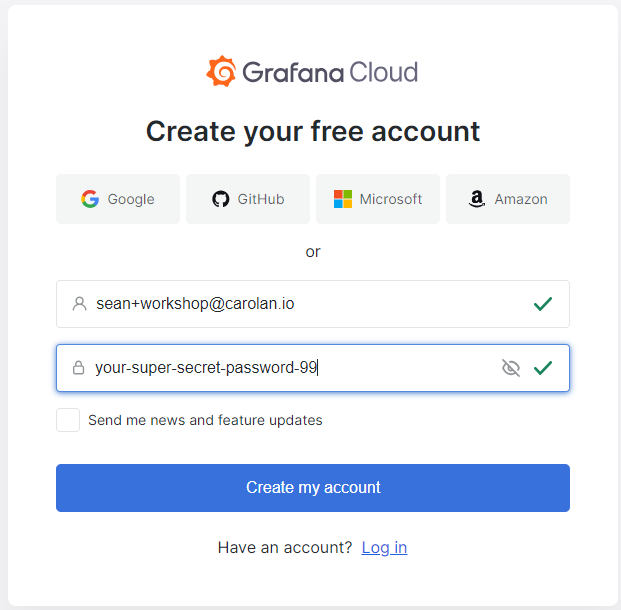

3. Verify that you are not a robot.

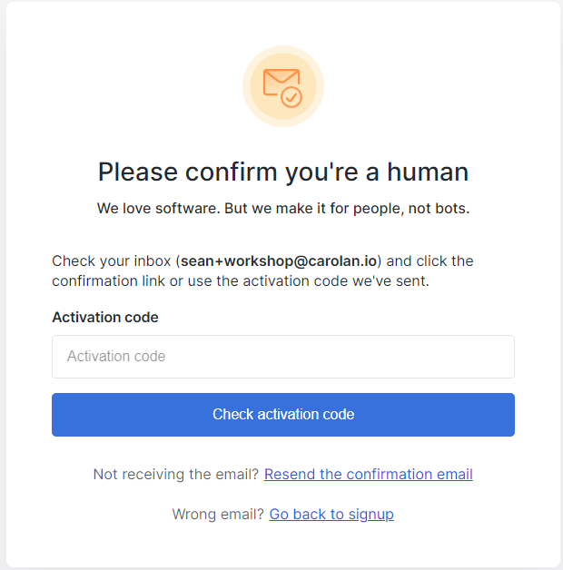

4. Give your stack a name and choose a region.

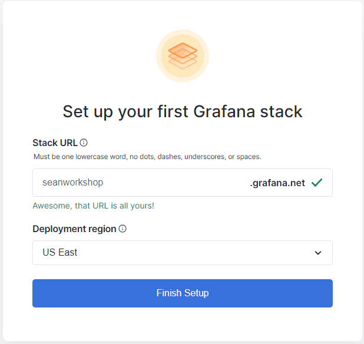

5. Wait a few minutes while your stack provisions. Now would be a good time to get up an stretch or get yourself a warm beverage ☕.
6. Once your stack is provisioned log in and bookmark your URL. Congratulations, you have a free Grafana Cloud account!

## Step 2: Enable the Infinity Plugin and Datasource

Next, you’ll enable a plugin that will help us pull in weather data from an external API (yes, you’re about to summon data from the heavens).

1. In your Grafana instance, click on the **Connections >> Add New Connection** menu option on the left sidebar.

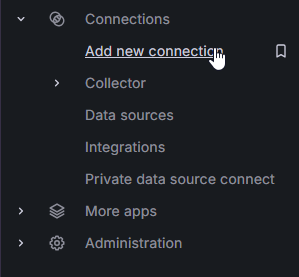

1. Search for **Infinity** and click on the Infinity Data source.

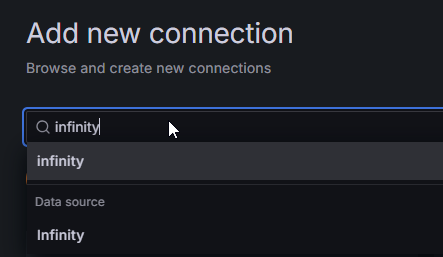

3. Click on the **Install** button to install the Infinity Data source.

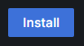

4. It may take a couple of minutes for the Infinity Data source to become visible. Click on the **Connections >> Data sources** link on the left menu. 

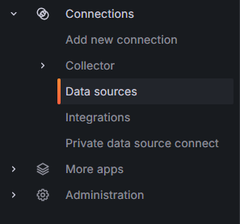

5. Click on "Add new data source"


6. Search for "Infinity". If it doesn't show up wait a minute and refresh the page. Once you see it click on it to add the Infinity data source.

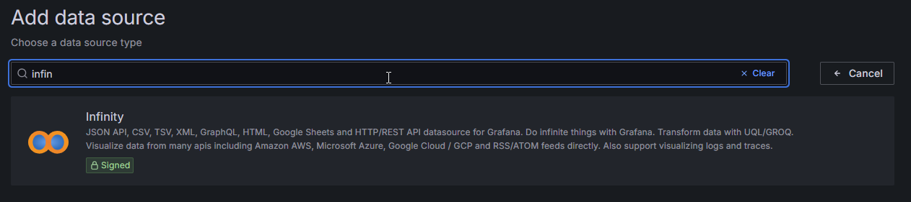

7. You'll see a popup notification once the data source has been correctly added. 

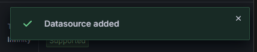

8. Leave the default name `yesoreyeram-infinity-datasource` for your data source. You may click **Save and Test** if you wish.

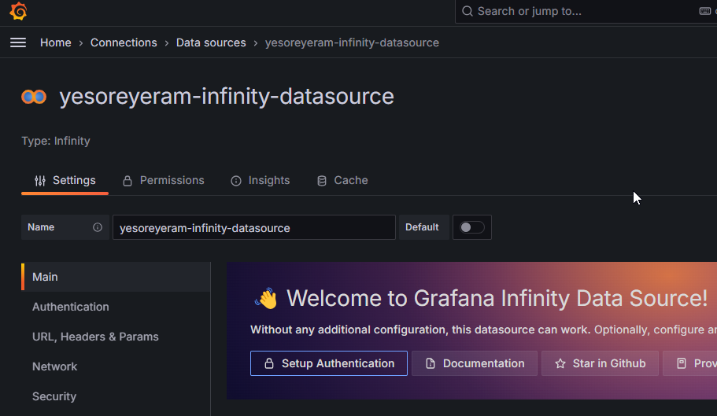

## Step 3: Import the Weather Dashboard

Now that your Infinity datasource is ready, it's time to import the weather dashboard.

1. Go to the **Dashboards** (four-square icon) on the left sidebar.
2. Click on **Import** at the top.
3. Upload the `weather-forecast.json` file that you can find in the 01-the-journey-begins folder of this repository.
4. During the import process, you will be prompted to select a data source. Choose the Infinity datasource that you just created.
5. Click **Import** to load the dashboard.

## Step 4: Get Your Weather API URL

To make the weather dashboard work for your location, you need a special URL from the [National Weather Service](https://www.weather.gov/documentation/services-web-api). To find your URL you'll need to know your latitude and longitude.

1. Visit [maps.google.com](maps.google.com) and search for your location (or wherever you want your weather forecast). Right click on the location you want and you'll see a popup with the latitude and longitude. Click on the latitude and longitude to copy it to your clipboard.

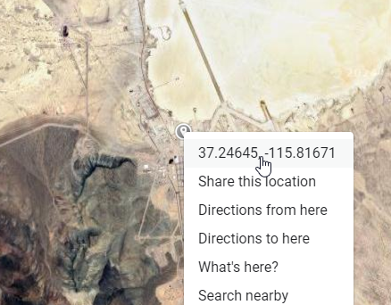

2. Open a new browser tab and type in this URL but don't hit enter yet!

```
https://api.weather.gov/points/
```

3. Right after the final slash, paste in the latitude and longitude you got from Google Maps.

> **⚠️Important!**
> There's a space after the comma that you must delete for the URL to work!


The final URL you end up at rounds the latitude and longitude to 4 digits. It will look like this:

```
https://api.weather.gov/points/42.5704,-73.6885
```

4. This JSON response contains data about your nearest detected NWS station. Scroll down until you see the "forecast" key under "properties":

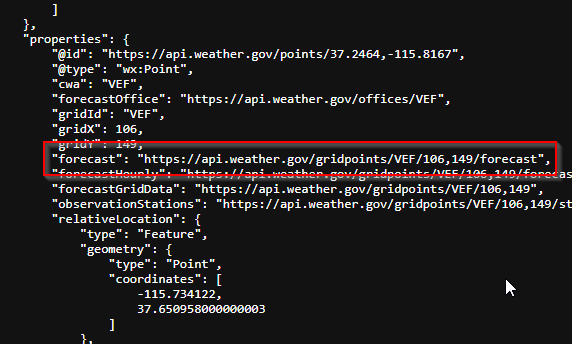

5. Copy the forecast URL for the next step.

## Step 5: Update the Dashboard with Your Weather URL

Now that you have your gridpoint URL, let's update the dashboard to use it.

1. Open the weather dashboard you imported earlier.
2. At the top of the dashboard there's a text box with a URL in it. Replace it with your own forecast URL:

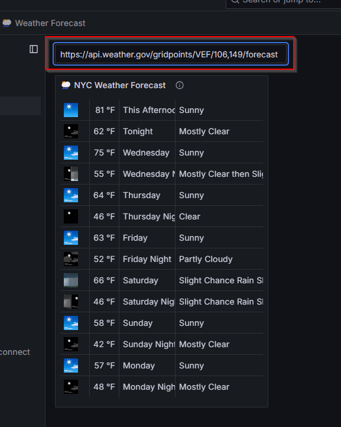

3. Notice how the weather forecast changes once you paste in the new URL.

## Step 6: Customize  and Save Your Dashboard

Next we'll rename the forecast panel on the dashboard.

1. Use the triple dot menu on the panel to select the **Edit** option.

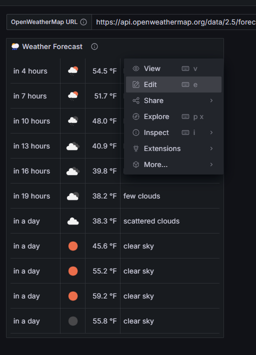

2. On the right side you'll see all your panel options. Update the panel's title to your own location.

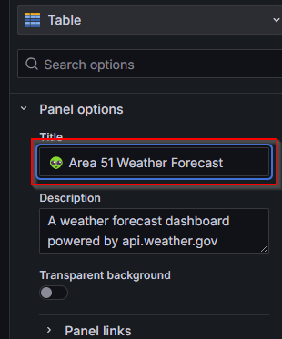

3. Save the dashboard with the button at the top of the page.

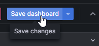

4. Add a note and make sure you select the checkbox to update your forecast default location.

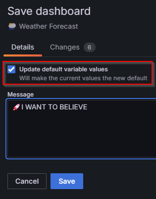

5. Use the "Back to Dashboard" button to return to the dashboard view.

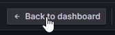

6. Congratulations, you completed the challenge!

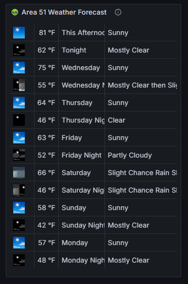


## Step 7: Save and Celebrate

You’ve completed your first challenge! Now, any time you want to check the weather, your magical forecast dashboard is just a click away.

Congratulations, hero! You’ve learned how to:

- Sign up for Grafana Cloud.
- Enable a plugin and set up a datasource.
- Import and customize a dashboard.
- Use the National Weather Service API to pull in live data.

Your journey is just beginning. Next up, you'll face your first true trial: **monitoring a Linux server**. Ready to take on the next challenge? Head over to **02: The First Trial** when you're ready!
