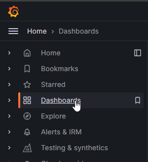
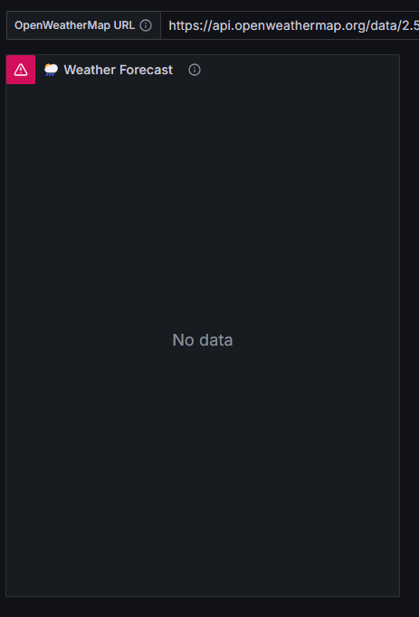

# The Journey Begins - Mobile Weather Dashboard


Welcome to the first step of your Grafana Cloud adventure! In this chapter, you'll be setting up a weather forecast dashboard that you can check any time to keep an eye on the skies. Think of this as your magical artifact—only instead of conjuring storms, you'll be predicting them. Here's how your weather forecast will look when it's done. The dashboard is optimized for viewing on mobile devices so you can check the forecast on your phone.


This is a fun and interactive journey where you'll:

1. Sign up for Grafana Cloud.
2. Get an OpenWeatherMap API key.
3. Enable the Infinity plugin and data source.
4. Import a pre-configured weather dashboard.
5. Customize your dashboard to make it uniquely yours.

Grab your gear, and let's begin!

## System Requirements 📃

- [Grafana Cloud Account](https://grafana.com/auth/sign-up/create-user)
- A modern browser (Chrome, Firefox, Edge, or Safari)
- An [OpenWeatherMap API key](https://openweathermap.org/api)

## Step 1: Sign up for Grafana Cloud ☁️

Your first task is to sign up for a free Grafana Cloud account.

1. Head over to [Grafana Cloud](https://grafana.com/auth/sign-up/create-user).
2. Choose one of the identity providers to create your account.


3. Verify that you are not a robot.


4. Give your stack a name and choose a region.


5. Wait a few minutes while your stack provisions. Now would be a good time to get up an stretch or get yourself a warm beverage ☕.
6. Congratulations, you have your own Grafana Cloud stack! You can log on and manage your account settings and stacks at grafana.com. 

> **🪄 Protip:**
> 
> Bookmark your stack's URL for quick and easy reference later. Your stack URL looks like this: https://YOURSTACKNAME.grafana.net

## Step 2: Get an OpenWeatherMap API Key 🔑

Before we set up Grafana, you'll need to get an API key from OpenWeatherMap to access weather data.

1. Visit [OpenWeatherMap's signup page](https://home.openweathermap.org/users/sign_up)
2. Fill out the registration form with:
   - Username
   - Email address
   - Password

3. Make sure to check the boxes for:
   - "I am 16 years old and over"
   - "I agree with Privacy Policy, Terms and conditions"

4. You can optionally subscribe to their news and updates.

5. Click "Create Account" and check your email for a verification link.

6. After verifying your email, log into your account and go to the [API keys page](https://home.openweathermap.org/api_keys).

7. You'll see a default API key already generated. You can use this key or create a new one by entering a name and clicking "Generate".


8. Copy your API key and store it somewhere safe - you'll need it later when setting up the dashboard.

> **⚠️ Important Notes:**
> 
> - The free API key has a limit of 60 calls per minute, which is plenty for personal use
> - New API keys take a few hours to activate after creation
> - Keep your API key private - don't share it publicly

**You may need to pause the tutorial and come back in a few hours.** OpenWeatherMap can take up to 3 hours to activate new API keys. Now that you have your API key, let's set up the tools we'll need in Grafana Cloud.

## Step 3: Enable the Infinity Plugin and Data Source ♾️

Next, you'll enable a plugin that will help us pull in weather data from the OpenWeatherMap API.

1. In your Grafana Cloud stack, click on the **Connections >> Add New Connection** menu option on the left sidebar.


2. Search for **Infinity** and click on the Infinity data source.


3. Click on the **Install** button to install the Infinity data source.


4. It may take a couple of minutes for the Infinity data source to become visible. Click on the **Connections >> Data sources** link on the left menu. 


5. Click on "Add new data source"


6. Search for "Infinity". If it doesn't show up wait a minute and refresh the page. Once you see it click on it to add the Infinity data source.


7. You'll see a popup notification once the data source has been correctly added. 


8. Leave the default name `yesoreyeram-infinity-datasource` for your data source. You may click **Save and Test** if you wish.


## Step 4: Import the Weather Dashboard 📝

Now that your Infinity data source is ready, it's time to import the weather dashboard.

1. Go to the **Dashboards** (four-square icon) on the left sidebar.



2. Click on **Import** at the top.


3. Upload the [weather-forecast-f.json](./weather-forecast-f.json) or [weather-forecast-c.json](./weather-forecast-c.json) file that you can find in the 01-the-journey-begins folder of this repository. You may copy and paste the JSON or upload the entire file. The only difference between these dashboards is the temperature unit (F or C).


4. During the import process, you will be prompted to select a data source. Choose the Infinity data source that you created in Step 4.


5. Click **Import** to load the dashboard.

6. Great work, now you have the default weather forecast dashboard. It will appear broken until you fill in your OpenWeatherMap URL at the top of the dashboard.



The URL at the top can be changed to show the weather forecast in any city in the world. In the next step you'll create your OpenWeatherMap forecast URL for your city.

## Step 5: Update the Dashboard with Your Weather Settings 🗺️

Now that you have your API key, let's update the dashboard to use it.

1. Open the weather dashboard you imported in the previous step.

2. At the top of the dashboard, you'll need to construct your OpenWeatherMap API URL:
   - Start with: `https://api.openweathermap.org/data/2.5/forecast?`
   - Add your city name with spaces replaced by %20 (e.g., "San Francisco" becomes "San%20Francisco")
   - Add the country code: `,US`
   - Add units and your API key
   - Units can be 'imperial' (°F) or 'metric' (°C). This must match the dashboard file you imported!
   
   Your final URL should look similar to this. You can copy this URL and simply replace the city, country code and API key:
   ```
   https://api.openweathermap.org/data/2.5/forecast?q=San%20Francisco,US&units=imperial&appid=YOUR_API_KEY_HERE
   ```

3. Paste your constructed URL into the URL field at the top of the dashboard.


5. The weather forecast will update automatically once you enter your URL.

> **🪄 Protip:**
> 
> Common city formats:
> - New%20York,US
> - London,UK
> - San%20Francisco,US
> - Los%20Angeles,US

## Step 6: Customize and Save Your Dashboard 💾

Next we'll rename the forecast panel on the dashboard.

1. Use the triple dot menu on the top right corner of the panel to select the **Edit** option.


2. Save the dashboard with the button at the top of the page. **make sure you select the checkbox to update your forecast default location**.


4. Use the "Back to Dashboard" button to return to the dashboard view.


5. Click on the "Exit Edit" button to exit edit mode.


6. Congratulations, you completed the challenge!


## Step 7: Enjoy Your Custom Weather Forecast 🍾

You've completed your first challenge! Now, any time you want to check the weather, your magical forecast dashboard is just a click away.

> **🪄 Protip:**
> 
> Log onto your Grafana Cloud stack with your mobile device and add a bookmark to your home screen for quick access to your dashboard!

Congratulations, hero! You've learned how to:

- Sign up for Grafana Cloud.
- Get and configure an OpenWeatherMap API key.
- Enable a plugin and set up a data source.
- Import and customize a dashboard.
- Use the OpenWeatherMap API to pull in live weather data.

Your journey is just beginning. Next up, you'll face your first true trial: **monitoring a Linux server**. 

Ready to take on the next challenge?

If you have an Ubuntu Linux VM, head over to [**02: The First Trial**](../02-the-first-trial/README.md) when you're ready!

If you don't have an Ubuntu VM or cloud instance, visit [**00: Prepare Your Equipment**](../00-prepare-your-equipment/README.md) to set up Virtualbox.
