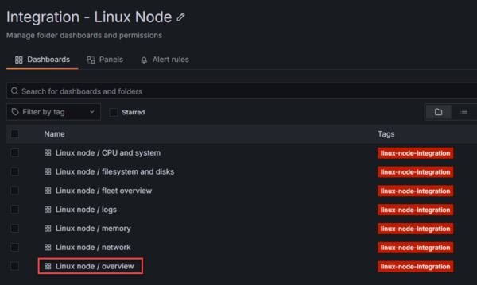

# 🔭 The First Trial – Monitor a Linux Server

Welcome to your first technical trial, brave observer. In this chapter, you’ll learn how to instrument and monitor an Ubuntu Linux VM using the **Grafana Alloy agent**. Let’s begin your path toward observability mastery.


---

## 🛠️ System Requirements

Before you set off, make sure you’ve gathered the following gear:

- A **Grafana Cloud Free Tier** account – <a href="https://grafana.com/auth-sign-up/create-user" target="_blank">Sign up here</a>
- A modern browser – Chrome, Firefox, Edge, or Safari  
- An Ubuntu Linux VM – use <a href="https://killercoda.com/scarolan/scenario/grafana-lab" target="_blank">Killercoda</a> or set one up via <a href="../00-prepare-your-equipment/README.md" target="_blank">VirtualBox</a>

---

## ⚙️ Step 1: Add a New Connection in Grafana Cloud

Log in to your Grafana Cloud stack and head to  
**Connections** → **Add new connection**.


Choose **Linux Server** from the integration options:


---

## 🧪 Step 2: Install the Grafana Alloy Agent

On the **Linux Server integration** page, follow these four steps:

1. **Select platform**  
   Stick with the defaults: **Debian** and **amd64**.

2. **Install Grafana Alloy**  
   Click the blue **Run Grafana Alloy** button. A new window will open.

   

   Give your new token a name like `grafana-workshop-token`.  
   No need to copy it manually—it’s baked into your install command.

   > ⚠️ **Heads up**: Don’t click **Test Alloy Connection** just yet!

   Scroll to **Install and run Grafana Alloy** and copy the command shown.  
   Paste it into your Ubuntu VM terminal.

   

   If the installation was successful, you’ll see output like this:

    ```
    Alloy is now running!

    To check the status of Alloy, run:
    sudo systemctl status alloy.service

    To restart Alloy, run:
    sudo systemctl restart alloy.service

    The config file is located at:
    /etc/alloy/config.alloy
    ```

   Once it's installed, now you can click **Test Alloy Connection**.  
   If everything worked, you'll see this:

   

   Click **Proceed to install integration** to continue.

3. **Make optional selections**  
   You can skip this—defaults are good for now.

4. **Prepare your configuration file**  
   At this point, Alloy is checking in but not yet sending data.  
   Copy the config snippet shown and paste it into `/etc/alloy/config.alloy`.

   - On **Killercoda**, the built-in editor will auto-save it.
   - On **VirtualBox**, use `nano` or `vim`.

   

---

## 🔄 Step 3: Restart Alloy and Test Again

Restart the Alloy agent:

```bash
sudo systemctl restart alloy
```

Back in Grafana Cloud, click **Test connection**.  
You should see:

```
Integration is collecting data and sending it to Grafana Cloud.
```

---

## 📊 Step 4: Install Dashboards and Alerts

Now that your VM is connected and sending data, click **Install** to set up default dashboards and alerts.

> If the dashboards are already installed, the button will be grayed out.


Click **View Dashboards**, then select the  
**Linux node / Overview** dashboard.



---

## 🎉 Step 5: Victory!

You’ve completed your first observability trial!

Your Ubuntu VM is now streaming metrics and logs to Grafana Cloud.  
Explore the dashboards, tweak them to your liking, and prepare for the next quest.

🧙 *Your journey has just begun...*
